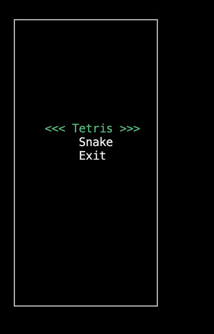
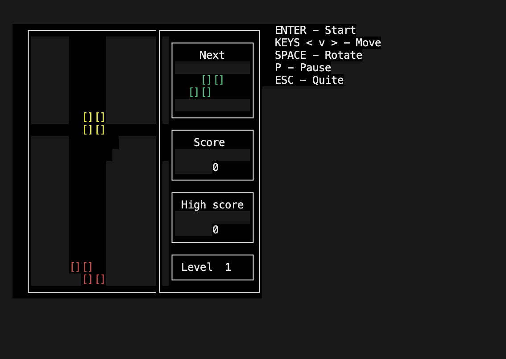
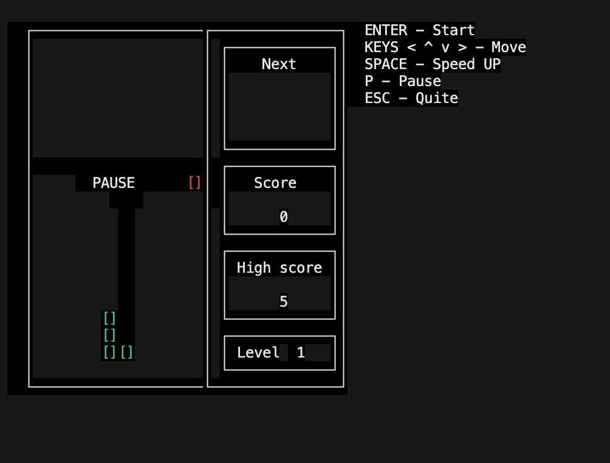
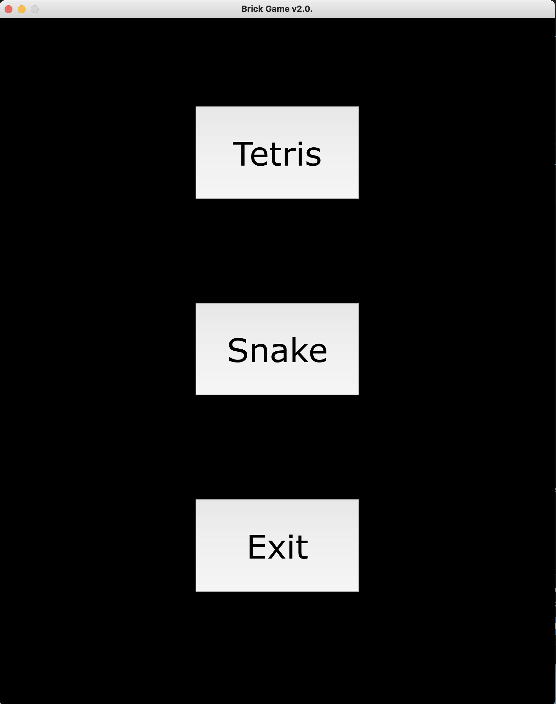
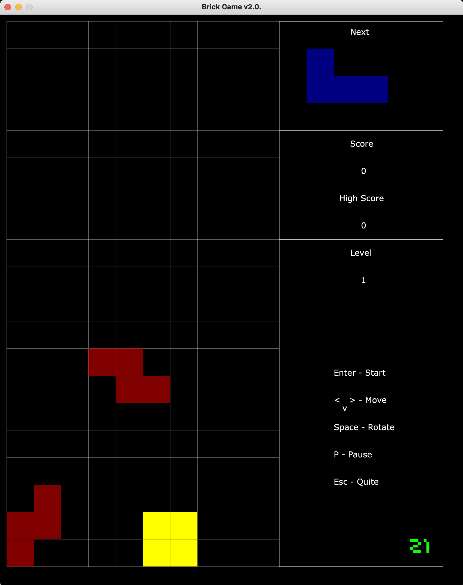
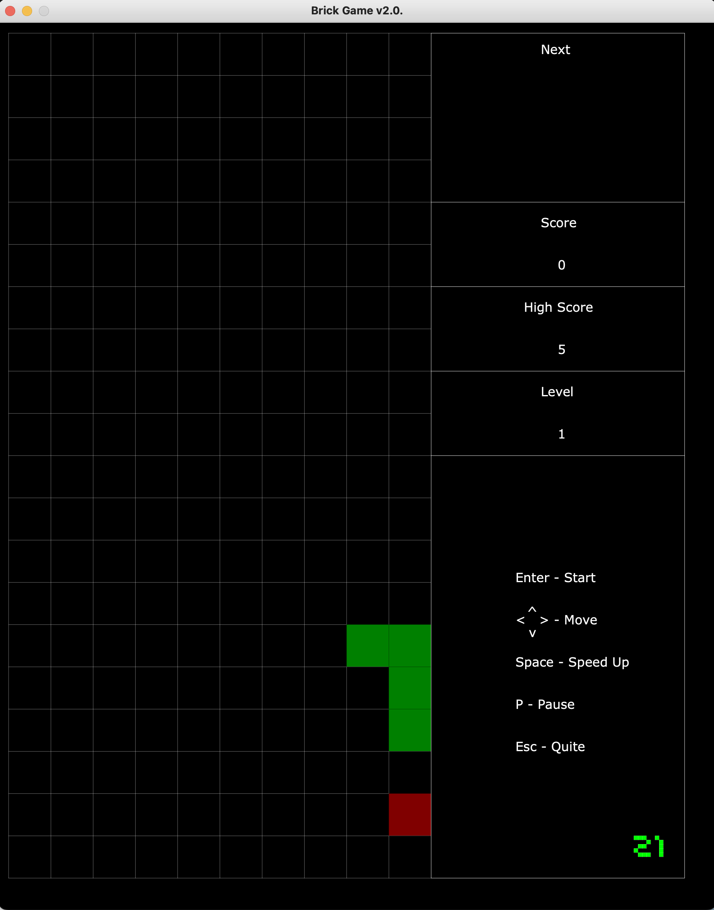

# BrickGame_v2.0"

## Brick Games Tetris and Snake on C and C++ languages with FSM"

`make`

### 1. Console version
Console version was writed with `ncurses` lib

use `make run_console`

- 
- 
- 

### 2. Desktop version
Desktop version was writed with `Qt6` lib

use  `make run_desktop`

- 
- 
- 